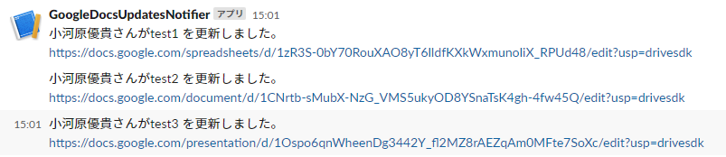
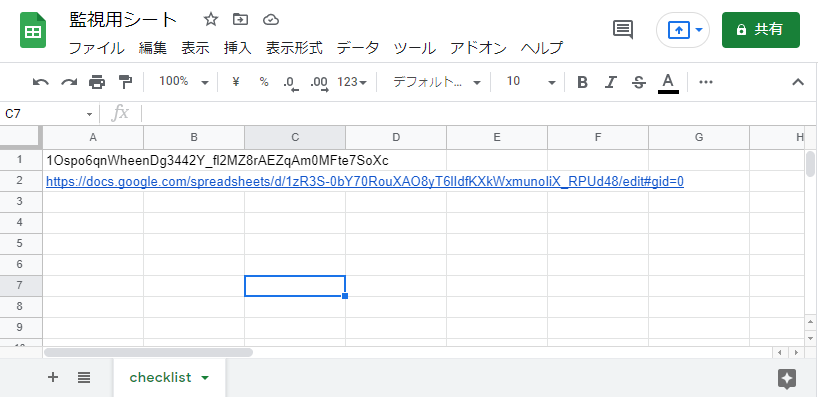
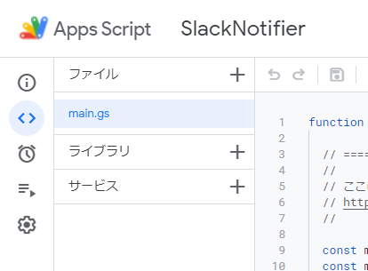
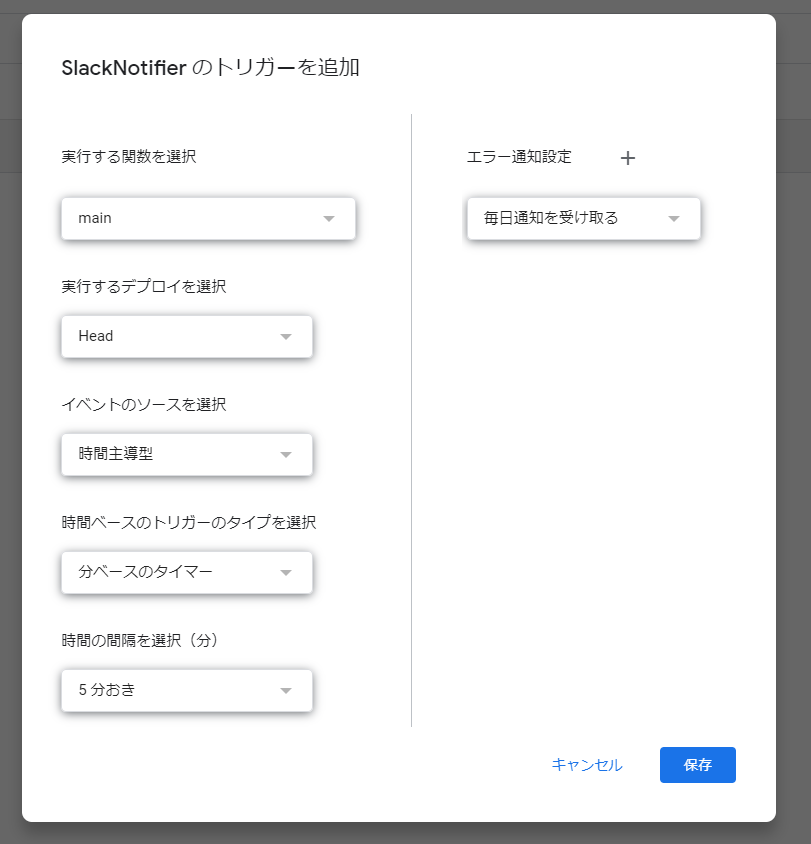
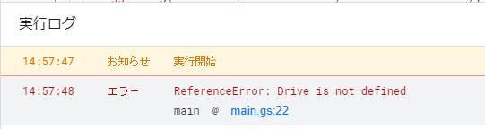

# 概要

GoogleAppsのファイルが更新されたときにSlackに通知を行うGASです

# 使い方

1. 監視を行いたい対象のURLもしくはファイルID(`スプレッドシートの場合だと https://docs.google.com/spreadsheets/d/<スプレッドシートのファイルID>/edit`)を `checklist` というシート名のシートに記載します。

2. 以下の設定手順に沿って設定を行います。

# ⚙設定手順

## 準備

1. Slackの通知用チャンネルを作成する
2. [SlackのWebhookを作成](https://slack.com/intl/ja-jp/help/articles/115005265063-Slack-%E3%81%A7%E3%81%AE-Incoming-Webhook-%E3%81%AE%E5%88%A9%E7%94%A8)して、URLを取得する
3. GASのプロジェクトを作成して `main.gs` をコピペする
4. `main.gs` の設定を行う(詳細は後述)
5. エディタ上から `Drive API v2` のライブラリを追加する
6. 定期的にGASを実行するトリガーを追加

### main.gs の設定に関して

以下の4つの変数を設定します。
- monitoringSheetId (監視対象のURLもしくはファイルIDを記載したスプレッドシートのファイルID)
- monitoringIntervalMinute (監視間隔、通知間隔と同じに設定することを推奨)
- slackWebhookURL (Slackの通知用WebhookURL)
- slackChannel (Slackの通知先のチャンネル名)

### Drive API v2のライブラリの追加に関して

エディタの「サービス」メニューを選択  

サービス一覧から `Drive API` を選択して、追加をクリックして登録する。

### トリガーの追加に関して

以下の画像に沿ってトリガーを追加する。
トリガーの実行間隔は監視間隔と合わせて設定する

# ⚠️問題が起きた時

## ReferenceError: Drive is not defined のエラーが発生する

  

GASのエディタ上で `Drive API v2` のライブラリが追加されているかご確認ください。  

https://stackoverflow.com/questions/50823383/referenceerror-drive-is-not-defined  